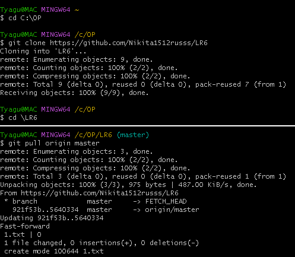
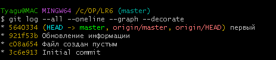
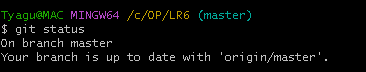
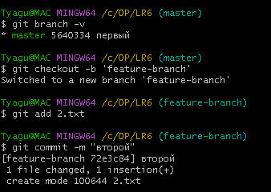
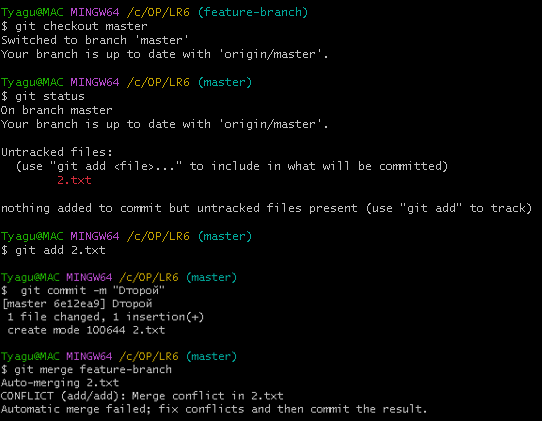
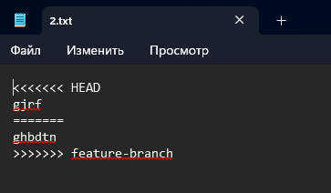
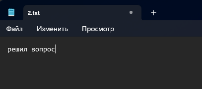
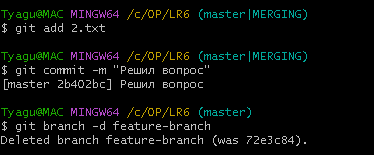
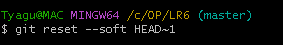
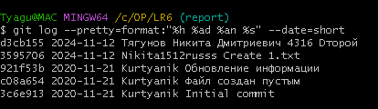

# Отчет по лабораторной работе № 2

### Тягунов Н.Д.  Группа № 4316

---

## 1. Создание аккаунта на GitHub

- Аккаунт успешно создан на [GitHub](https://github.com/Nikita1512russs).
- А также успешно привязан в Git Bash и новый файл через интерфейс GitHub.

## 2. Копирование репозитория (Fork)

- Оригинальный репозиторий находится по адресу: https://github.com/Kurtyanik/LR6/.
- Репозиторий скопирован в личное хранилище с помощью кнопки **Fork**.

## 3. Установка Git

- Git установлен с официального сайта.

## 4. Клонирование репозитория и пулл изменений 

## 5. Вывод истории коммитов для каждой из веток

- Так как по умолчанию ветка всего одна - то история только для master.

## 6. Проверка ветки с помощью git status
 
- При проверке видим, что нет незафиксированных файлов.

## 7. Создание и разрешение конфликта при слиянии веток

- Так как в изначальном репозиторие была всего одна ветка, чего недостаточно, для конфликтной ситуаци, то создам ещё одну ветку на которой создам файл example.txt и внесу в него некоторые изменения.

- Далее создаю такой же файл example.txt в master и вношу в него изменения, а потом приступаю к слиянию и получаю конфликт.

- Так выглядит конфликт внутри файла.
  

- Конфлик решён, путём самостоятельного внесения изменений в файл и сохранения изменений.
  

## 8. Фиксация изменений после разрешения конфликта и удаление ненужной ветки

## 9. Откат последнего коммита

## 10. Использованные команды
- git clone https://github.com/username/repo.git - Клонирование удалённого репозитория на локальный носитель
- git checkout -b new-branch - Создание и переход на созданную ветку
- git add . - Фиксация файлов (в данной вариации всех незафиксированных файлов)
- git add FileName - Фиксация файла
- git commit -m "Added new feature" - Создание комментария (слепок изменений)
- git push origin new-branch - отправка коммитов в удалённый репозиторий

## 11. Получение истории операций в форматированном виде

# Вывод:
В ходе выполнения лабораторной работы я освоил основные команды Git и GitHub, что существенно упростило управление версиями и совместную работу над проектами. Практика разрешения конфликтов при слиянии веток укрепила мои навыки работы с потенциальными проблемными ситуациями. Написание отчета в формате Markdown показало важность документирования процесса разработки.